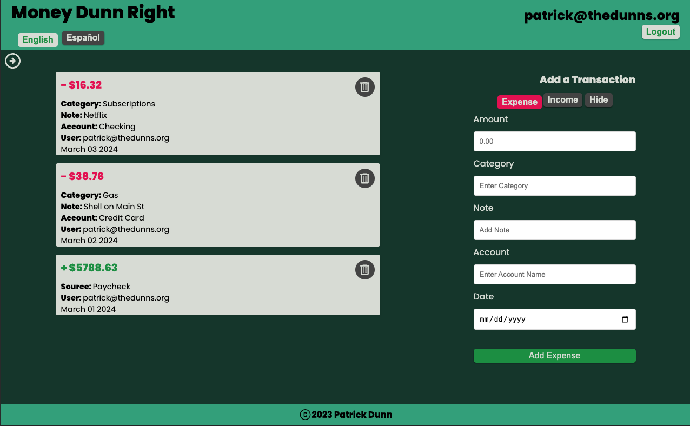

# Money Dunn Right

[https://money-dunn-right.netlify.app/](https://money-dunn-right.netlify.app/)

### Full Stack MERN application for personal finance. Users can create, view, and delete expense and income cards. All transactions are presented in a chronologically-sorted list. The site allows users to seamlessly toggle between English and Spanish.

##  Languages & Technologies

[Contents](#contents)  

##  Contents

- [Languages](#languages)
- [Features](#features)
- [Motivation](#motivation)
- [Usage](#usage)
- [Challenges](#challenges)
- [Contributors](#contributors)
- [License](#license)

##  Features

[Contents](#contents)  
The app's user-facing content was translated so that users can instantaneously toggle the site between English and Spanish. There's no need to create an account first before adjusting user settings. Thanks to React's virtual DOM this feature is always available. In order to limit the chances of a mobile user accidentally deleting a transaction card by carelessly clicking the trash icon once, a double-click requirement was added. Upon the first click the icon's background changes from gray to red, indicating that the button is now active. By touching (or clicking) anywhere else on the screen that particular button will be deactivated. Rather than requiring a modal or (heaven forbid) an alert asking the user if they're sure they want to delete the transaction, this feature was designed to be intuitive and user-friendly. The 'Hide' button for the transaction form was also inspired by mobile users. If users don't need to add a transaction at the moment, they can save valuable screen real estate by hiding the expense or income form.

##  Motivation

[Contents](#contents)  
Rather than jotting-down expenses or holding on to receipts and then entering those transactions once I'd returned home, I wanted to persist those transactions immediately using a web app on my mobile device.

##  Usage

[Contents](#contents)  
Users can access the site on any device as the site is fully responsive. Even though it's a web app, users can add an app tile to the home screen of their mobile device directy from the browser. There's no need to download anything from an app store.

##  Challenges & Lessons Learned

[Contents](#contents)  
During development I tried to follow an AGILE approach. I asked for continual feedback from prospective users and aimed to add features such that each deployed version of the app was functional. This approach forced me to discretely define objectives and meet those objects first before moving on to the next desired piece of functionality. For example, the language toggle was added on-top of an already-functional application that allowed users to track transactions.

##  Contributors

[Contents](#contents)

- Patrick Dunn // [pmdunn78@gmail.com](mailto:pmdunn78@gmail.com) // [github.com/knightmac19](https://github.com/knightmac19)

##  Questions

[Contents](#contents)  
Please direct any questions to [pmdunn78@gmail.com](mailto:pmdunn78@gmail.com).

##  License

[Contents](#contents)  
Copyright 2023 Patrick Dunn

Permission is hereby granted, free of charge, to any person obtaining a copy of this software and associated documentation files (the "Software"), to deal in the Software without restriction, including without limitation the rights to use, copy, modify, merge, publish, distribute, sublicense, and/or sell copies of the Software, and to permit persons to whom the Software is furnished to do so, subject to the following conditions:

The above copyright notice and this permission notice shall be included in all copies or substantial portions of the Software.

THE SOFTWARE IS PROVIDED "AS IS", WITHOUT WARRANTY OF ANY KIND, EXPRESS OR IMPLIED, INCLUDING BUT NOT LIMITED TO THE WARRANTIES OF MERCHANTABILITY, FITNESS FOR A PARTICULAR PURPOSE AND NONINFRINGEMENT. IN NO EVENT SHALL THE AUTHORS OR COPYRIGHT HOLDERS BE LIABLE FOR ANY CLAIM, DAMAGES OR OTHER LIABILITY, WHETHER IN AN ACTION OF CONTRACT, TORT OR OTHERWISE, ARISING FROM, OUT OF OR IN CONNECTION WITH THE SOFTWARE OR THE USE OR OTHER DEALINGS IN THE SOFTWARE.
